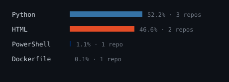
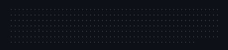

<picture></picture>

  

> Self-typing ASCII portrait and live language stats, drawn by this repository. 
> No third-party widgets, no services that can rate-limit or go dark.

  

<picture></picture>

 

<picture></picture>

  

<picture></picture>

 

<picture></picture>

   

Generated inside this repository by a scheduled GitHub Action running 
<samp>scripts/generate_stats.py</samp> and <samp>scripts/generate_portrait.py</samp>. 
Zero third-party requests, zero external services to break.

