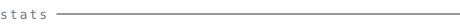
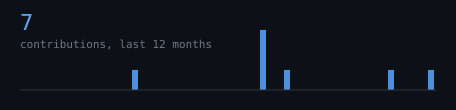
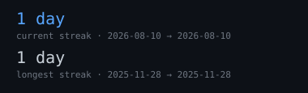

<picture>
  
</picture>

 

> Self-typing ASCII portrait and live contribution stats, drawn by this repository. 
> No third-party widgets, no services that can rate-limit or go dark.

 

<picture>
  
</picture>

<picture>
  
</picture>
<picture>
  
</picture>

 

<picture>
  
</picture>

<picture>
  
</picture>

 

<picture>
  
</picture>

<picture>
  
</picture>

  

Everything on this page is generated inside this repository by a scheduled 
GitHub Action running <samp>scripts/generate_stats.py</samp> and <samp>scripts/generate_portrait.py</samp>. 
Zero third-party requests, zero external services to break.
